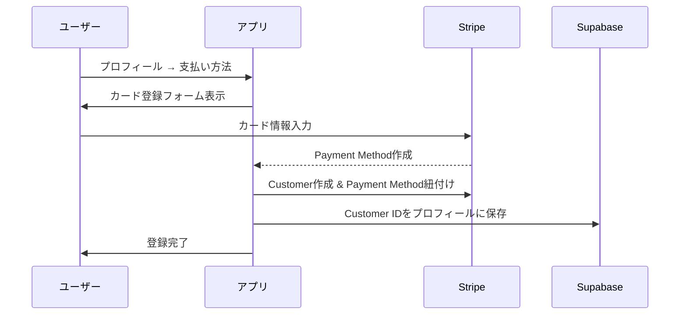
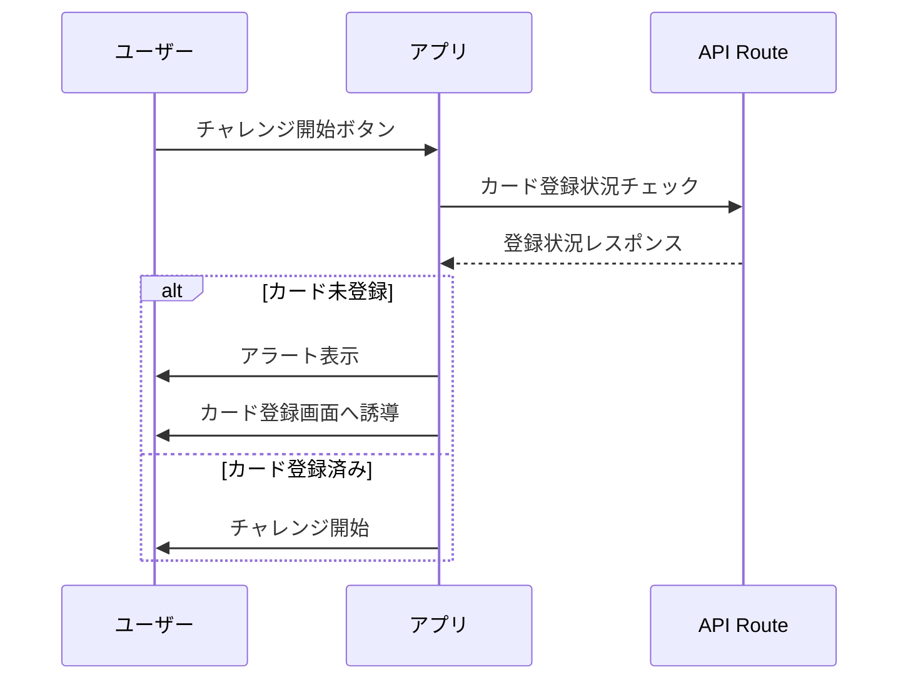
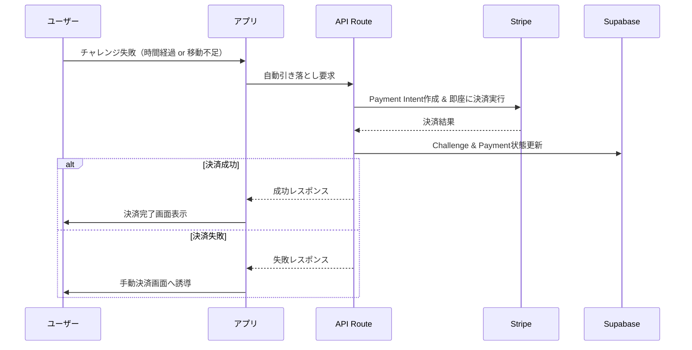

# 🎯 正しいサービスフロー実装完了

## ✅ 実装された正しいフロー

### 1. 会員登録時
- **カード情報の事前登録** が必須
- Stripe Customer作成 + Payment Method保存
- セキュアなカード情報管理（Stripe Elements使用）

### 2. チャレンジ開始時  
- **カード登録チェック機能** でブロック
- 未登録の場合 → アラート表示 + 登録画面誘導
- 登録済みの場合のみチャレンジ開始可能

### 3. チャレンジ失敗時
- **自動引き落とし実行**
- 登録済みカードから即座に決済
- 手動決済フォームは不要

---

## 🚀 実装ファイル

### **API Routes**
```
src/app/api/
├── setup-payment-method/route.ts    # カード登録・管理API
├── auto-charge/route.ts              # 自動引き落としAPI
├── create-payment-intent/route.ts    # 従来の決済インテント（フォールバック用）
├── confirm-payment/route.ts          # 決済確認API
└── webhooks/stripe/route.ts          # Stripe Webhook処理
```

### **コンポーネント**
```
src/components/
├── CardRegistration.tsx              # カード登録フォーム
└── PaymentForm.tsx                   # 従来の決済フォーム（フォールバック用）
```

### **ページ**
```
src/app/
├── profile/
│   ├── page.tsx                      # プロフィール画面
│   └── payment-methods/page.tsx      # カード管理画面
├── create-challenge/page.tsx         # カード登録チェック機能追加
├── active-challenge/page.tsx         # 自動引き落とし機能追加
└── challenge/[id]/
    ├── payment/page.tsx              # 手動決済（フォールバック）
    └── payment-success/page.tsx      # 決済完了画面
```

---

## 🔄 サービスフロー詳細

### **Step 1: カード情報事前登録**


### **Step 2: チャレンジ開始時チェック**


### **Step 3: チャレンジ失敗時自動引き落とし**


---

## 🛡️ セキュリティ & エラーハンドリング

### **セキュリティ対策**
- ✅ Stripe Elements使用（カード情報の暗号化）
- ✅ サーバーサイドでの Payment Method管理
- ✅ Webhook署名検証
- ✅ Customer IDとUser IDの紐付け検証

### **エラーハンドリング**
- 🔄 カード拒否 → 手動決済フォールバック
- 🔄 残高不足 → 手動決済フォールバック  
- 🔄 ネットワークエラー → リトライ機能
- 🔄 3Dセキュア認証 → 認証フロー対応

---

## 🧪 テスト手順

### **1. カード登録テスト**
```bash
# 1. プロフィール画面にアクセス
/profile

# 2. 支払い方法をクリック
/profile/payment-methods

# 3. テストカードで登録
カード番号: 4242 4242 4242 4242
有効期限: 12/34
CVC: 123
```

### **2. チャレンジ開始チェックテスト**
```bash
# 1. カード未登録状態でチャレンジ作成
/create-challenge

# 2. スライドで開始 → アラート表示確認
# 3. カード登録後に再テスト → 開始成功確認
```

### **3. 自動引き落としテスト**
```bash
# 1. チャレンジ開始
# 2. 意図的に失敗（時間経過 or 移動不足）
# 3. 自動引き落とし実行確認
# 4. 決済完了画面表示確認
```

---

## 📊 実装のメリット

### **従来フロー（修正前）**
❌ チャレンジ失敗時に手動決済フォーム表示  
❌ ユーザビリティが悪い  
❌ 決済逃れのリスク  

### **正しいフロー（修正後）**
✅ 事前カード登録で確実な決済保証  
✅ 失敗時の即座自動引き落とし  
✅ スムーズなユーザー体験  
✅ 決済逃れ防止  

---

## 🔧 運用開始手順

### **1. Webhook設定**
```bash
# ローカル開発
stripe listen --forward-to localhost:3000/api/webhooks/stripe

# 本番環境
# Stripe Dashboard でWebhookエンドポイントを設定
# https://yourdomain.com/api/webhooks/stripe
```

### **2. 環境変数確認**
```env
STRIPE_SECRET_KEY=sk_test_...
NEXT_PUBLIC_STRIPE_PUBLISHABLE_KEY=pk_test_...
STRIPE_WEBHOOK_SECRET=whsec_...
```

### **3. 本番デプロイ**
```bash
npm run build
npm run start
```

---

## 🎉 実装完了

正しいサービスフローが完全に実装されました！

**事前カード登録 → 自動引き落とし** の安全で確実な決済システムが稼働開始できます。