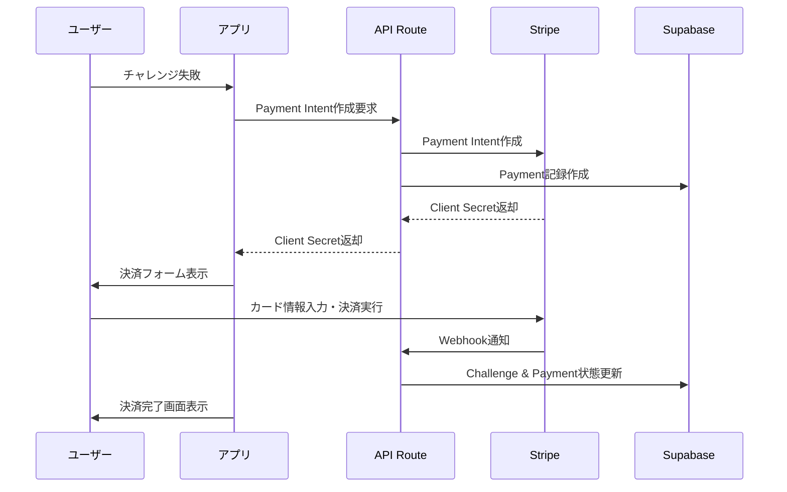

# Stripe決済機能セットアップガイド

## 🚀 実装完了項目

✅ **環境変数設定** (`.env.local`)
✅ **API Routes実装**
- `/api/create-payment-intent` - 決済インテント作成
- `/api/confirm-payment` - 決済確認・状態更新
- `/api/webhooks/stripe` - Stripe Webhook処理

✅ **フロントエンド実装**
- `PaymentForm.tsx` - 決済フォームコンポーネント
- `/challenge/[id]/payment` - ペナルティ支払いページ
- `/challenge/[id]/payment-success` - 決済完了ページ

✅ **Stripe設定更新**
- TypeScript型定義追加
- エラーハンドリング強化
- Customer ID対応

---

## ⚙️ Webhookセットアップ手順

### 1. Stripe CLIのインストール
```bash
# macOS
brew install stripe/stripe-cli/stripe

# その他のOS: https://stripe.com/docs/stripe-cli#install
```

### 2. Stripe CLIでログイン
```bash
stripe login
```

### 3. ローカル開発用Webhookの設定
```bash
# 開発サーバーが起動している状態で実行
stripe listen --forward-to localhost:3000/api/webhooks/stripe
```

### 4. Webhook Secretの取得と設定
上記コマンドを実行すると、以下のような出力が表示されます：
```
> Ready! Your webhook signing secret is whsec_1234567890abcdef...
```

この `whsec_` で始まる値を `.env.local` に設定：
```env
STRIPE_WEBHOOK_SECRET=whsec_1234567890abcdef...
```

### 5. 開発サーバーの再起動
```bash
npm run dev
```

---

## 🧪 テスト手順

### 1. テスト用カード番号
```
カード番号: 4242 4242 4242 4242
有効期限: 任意の未来の日付 (例: 12/34)
CVC: 任意の3桁 (例: 123)
郵便番号: 任意 (例: 12345)
```

### 2. テストフロー
1. チャレンジを作成
2. 意図的に失敗させる（時間を過ぎる）
3. `/challenge/[id]/payment` にアクセス
4. テストカード情報で決済を実行
5. 決済完了ページで確認

### 3. Webhookの確認
Stripe CLIのコンソールで以下のイベントが表示されることを確認：
- `payment_intent.succeeded`
- `customer.created`

---

## 🔧 本番環境での設定

### 1. Stripe Dashboard でWebhookエンドポイントを設定
1. Stripe Dashboard → Developers → Webhooks
2. "Add endpoint" をクリック
3. エンドポイントURL: `https://yourdomain.com/api/webhooks/stripe`
4. イベントを選択:
   - `payment_intent.succeeded`
   - `payment_intent.payment_failed`
   - `payment_intent.canceled`
   - `customer.created`

### 2. 本番用Webhook Secretを設定
本番環境の `.env.local` または環境変数に設定：
```env
STRIPE_WEBHOOK_SECRET=whsec_production_secret_here
```

---

## 📊 決済フロー概要



---

## 🔒 セキュリティ考慮事項

- ✅ Stripe Secret Keyはサーバーサイドのみで使用
- ✅ Webhook署名の検証を実装
- ✅ 決済金額の検証
- ✅ ユーザー認証の確認
- ✅ カード情報の暗号化（Stripe Elements使用）

---

## 🐛 トラブルシューティング

### Webhook が受信されない場合
1. `stripe listen` が実行中か確認
2. 開発サーバーが起動中か確認
3. `.env.local` のWEBHOOK_SECRETが正しいか確認

### 決済が失敗する場合
1. Stripe APIキーが正しいか確認
2. テスト用カード番号を使用しているか確認
3. ブラウザの開発者ツールでエラーログを確認

### TypeScript エラーが発生する場合
```bash
npm run build
```
でエラー内容を確認し、型定義を修正

---

## 📞 サポート

- [Stripe Documentation](https://stripe.com/docs)
- [Stripe Discord Community](https://discord.gg/stripe)
- [Next.js Stripe Integration Guide](https://stripe.com/docs/stripe-js/react)